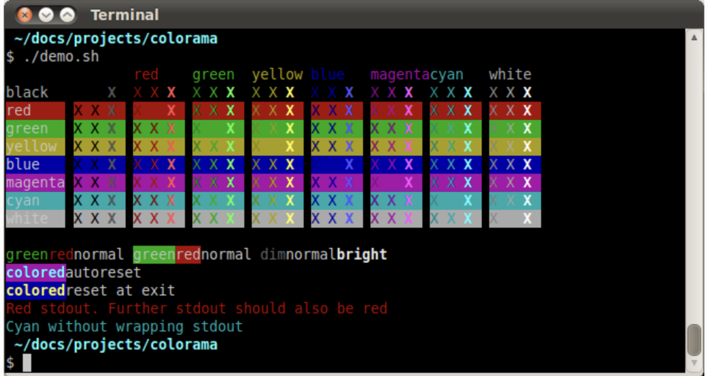
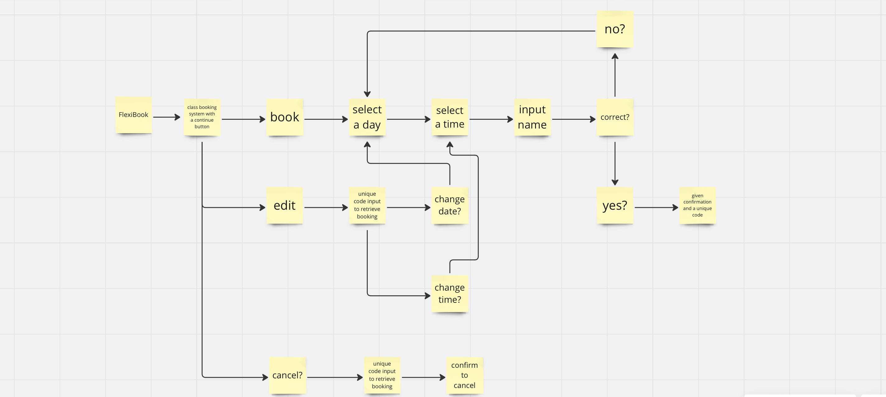
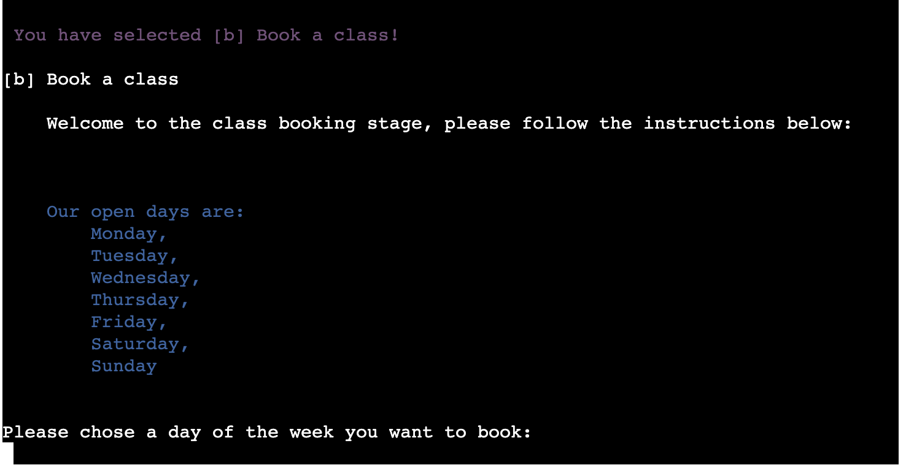
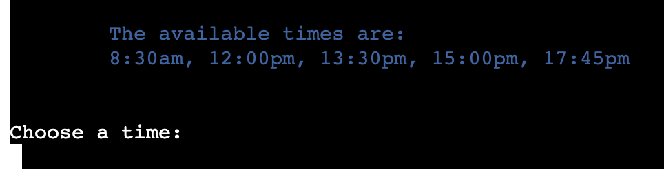
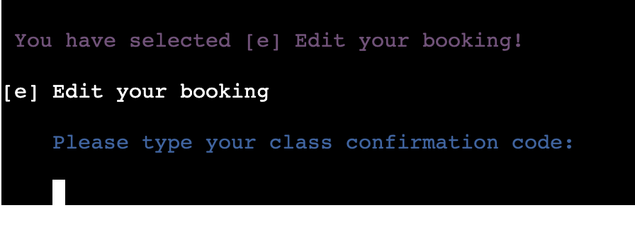
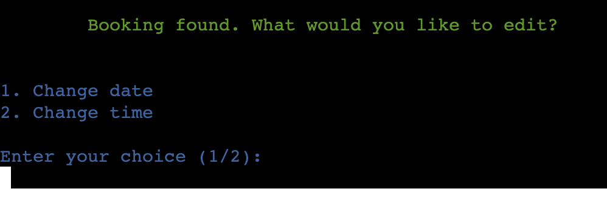
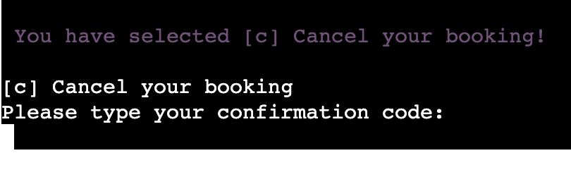
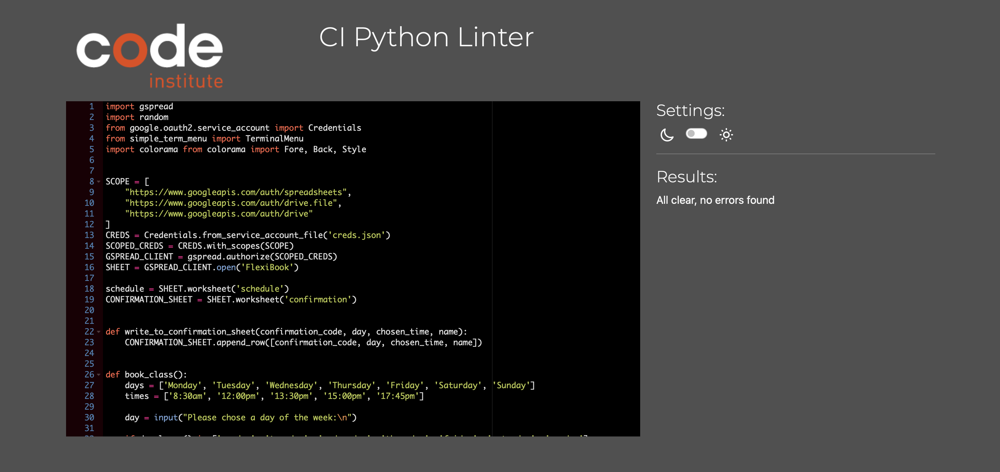
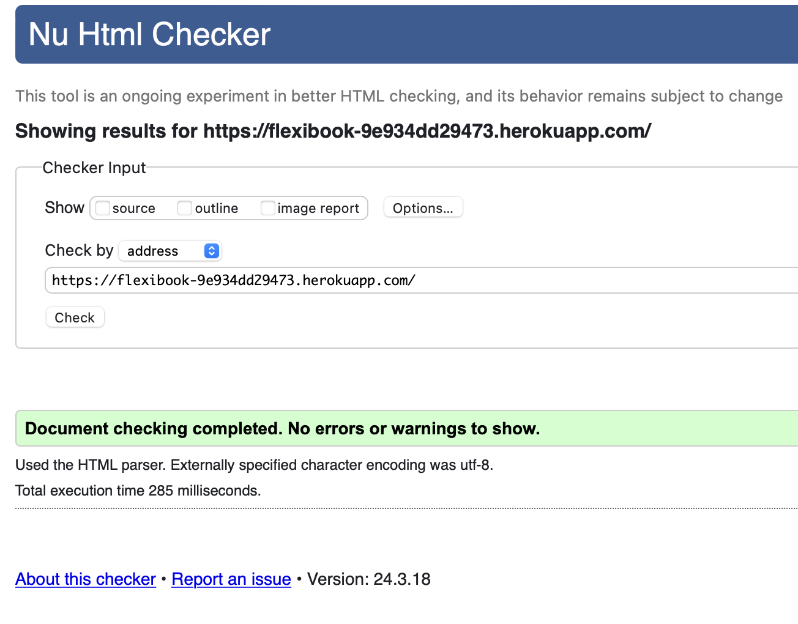

# FlexiBook - Analtics for Yoga Booking :lotus_position_woman::calendar:

### My Vision
This project is a simple web application built with Python. It enables users to book yoga classes and provides analytics on each class. The analytics are based on the number of bookings for each class, assisting the team in identifying which classes are more popular and which offers they can promote more effectively. This project is hosted on GitHub for version control and collaboration, and it can be deployed to Heroku, a cloud platform as a service (PaaS), for easy management and scalability.

[**Live Site**](https://flexibook-9e934dd29473.herokuapp.com/)

[**Repository link**](https://github.com/abikirkham/FlexiBook.git)

 

 
## Table of Contents

- [User Experience](#user_experience)
- [Design](#design)
- [Features](#features)
- [Technologies Used](#technologies_used)
- [Google Sheets](#google_sheets)
- [Testing](#testing)
- [Bugs](#bugs)
- [Browser Capability](#browser_capability)
- [Deployment](#deployment)
- [Credits](#credits)

## User Experience  :woman_technologist:

### For the Owner: 
1. **Viewing Available Classes:** As the owner, I want users to easily view available classes, so they can make informed booking decisions.

2. **Integration with Google Sheets:** As the owner, I want to integrate Google Sheets for streamlined management of class schedules, confirmation of each booking and organisation.

3. **Analytics Tracking:** As the owner, I want to track user engagement and preferences through analytics, enabling me to tailor classes and improve overall user experience.

4. **Simplified Administrative Tasks:** As the owner, I want administrative tasks such as adding new classes or managing instructor schedules to be simplified and efficient, allowing me to focus more on providing quality services to users.

5. **Seamless Integration with Existing Systems:** As the owner, I want the booking system to seamlessly integrate with other existing systems or tools we use for business operations, reducing the need for manual data entry and ensuring consistency across platforms.

### For the User:
1. **Finding Available Classes:** As a user, I want to easily find available classes based on my preferred time slots and yoga styles, so I can plan my schedule effectively.

2. **Seamless Booking Experience:** As a user, I want to have a seamless booking experience, with clear instructions and intuitive interface, making it convenient to reserve my spot in desired classes.

3. **Detailed Class Information:** As a user, I want to see detailed information about each class, the date, time, and confirmation code, to help me make informed decisions.
  
4. **Easy Editing/Cancellation:** As a user, I want the ability to effortlessly edit or cancel my class bookings, ensuring flexibility in managing my schedule without encountering unnecessary obstacles.

5. **Distraction-Free Experience:** As a user, I want the booking platform to provide a distraction-free experience, with minimal ads or irrelevant content, allowing me to focus solely on finding and booking the classes that align with my needs and preferences.

## Design  :art:

### Imagery 
The Flexibook logo, sourced from [F-Symbols](fsymbols.com), embodies adaptability and versatility through its design. The simplicity of the logo's typography belies its dynamic nature, mirroring the flexibility at the core of Flexibook's services. The use of text art adds a contemporary flair, emphasizing the brand's innovative approach. This logo promises a seamless and user-friendly experience, reflecting the convenience that Flexibook offers to its users.

  
Click to see my Logo.

 

### Colours
The color scheme drawn from Colorama, found on [PyPi](pypi.org), infuses Flexibook's branding with vibrancy and energy. Each color selected from Colorama contributes to the visual appeal and functionality of Flexibook's interface. The primary colors inject excitement and enthusiasm, encouraging user engagement, while the secondary colors provide balance and contrast for enhanced readability. Overall, the Colorama color scheme enhances Flexibook's branding, making it both visually appealing and user-friendly.

  
Click to see my Color Tool.

### Flow Chart
The flowchary was crafted when I was decisiding how I would structure and display my idea, this was created with [Miro](https://miro.com/app/board/uXjVNhD3dEI=/). This displays the option of the class booking sytem where the user will input their actions and generate a confirmation code once booked a class. The other options are for editting and cancelling the booked classes.

  
Click to see my flowchart.

  

### Requirements 
The deployment terminal is set to 80 columns by 24 rows. That means that each line of text needs to be 80 characters or less otherwise it will be wrapped onto a second line. This was indetified in the [Continuous Integration Python Linter](https://pep8ci.herokuapp.com/#) , which told you if you needed to shorten your lines when they were too long. 

## Features  :framed_picture:

1. **Run Programme - Logo/Welcome Message**  
   

   
Click to Expand.

   
   
   
   
   

2. **Navigate the Menu**  
   

   
Click to Expand.

   
   Upon running the program, you will be presented with a menu where you can choose to book a class, edit your booking, or cancel your booking.
   
   Functionality:  
   
   
   

3. **Book a Class**  
   

   
Click to Expand.

   
   This option allows you to book a yoga class following the guide below.
   
   - **Instructions**:
     - When prompted, enter the day of the week you wish to book (e.g., Monday).  
       
     - Then, choose a time slot from the available options.  
       
     - Enter your name as requested.  
       
     - Confirm the booking details when prompted. If correct, your booking will be confirmed with a unique confirmation code.  
         
         
     - After completing an action, you will be prompted to press Enter to return to the main menu.  
       
       
   - **Error Handling**:
     - If you say no when confirming the details of the booking.  
       
     - If you input an invalid day or time, you will receive a notification to try again.  
         
       
   
   

4. **Edit Your Booking**  
   

   
Click to Expand.

   
   If you need to make changes to your existing booking, select this option.
   
   - **Instructions**:
     - Enter your confirmation code when prompted.  
       
     - Select the aspect of your booking you wish to edit (date or time).  
       
     - Follow the prompts to make the necessary changes.  
         
       
     - Confirm the changes to update your booking.  
         
     - After completing an action, you will be prompted to press Enter to return to the main menu.  
       
   
   - **Error Handling**:
     - If you do not select the correct option, you will receive an error message.  
       
     - If you input an invalid confirmation code or choose an incorrect option, you will be prompted to try again.  
       
   
   

5. **Cancel Your Booking**  
   

   
Click to Expand.

   
   Use this option if you need to cancel your existing booking.
   
   - **Instructions**:
     - Enter your confirmation code when prompted.  
       
     - Confirm the cancellation when prompted.  
       
     - After completing an action, you will be prompted to press Enter to return to the main menu.  
       
   
   - **Error Handling**:
     - If you input an invalid confirmation code or choose an incorrect option, you will be prompted to try again.  
       
   
   

## Technologies Used  :desktop_computer:

- [HTML5](https://en.wikipedia.org/wiki/HTML5) [/CSS](https://en.wikipedia.org/wiki/CSS)
- [Python](https://en.wikipedia.org/wiki/Python_(programming_language))
- [Git](https://git-scm.com/) (Version Control)
- [GitHub](https://github.com/) (File Storage)
- [Heroku](https://www.heroku.com/) (Deployment)
- [GitPod](https://www.gitpod.io) (IDE)
- [Miro](https://miro.com/app/board/uXjVNhD3dEI=/) (Flowchart Creation)
- [LanguageTool](https://languagetool.org/) was used to check the grammar and spelling in the README and the Code.
- [ASCII Art Generator](https://patorjk.com/software/taag/#p=display&f=Small%20Keyboard&t=Type%20Something%20) (Logo Creation)
- [Google Spreadsheet](https://docs.google.com/spreadsheets/u/0/?pli=1) (Worksheet Creation)
- [Browserling](https://www.browserling.com/) (Cross-browser Testing)

### Libraries and Modules

- [`google.oauth2.service_account`](https://google-auth.readthedocs.io/en/master/reference/google.oauth2.service_account.html) (Google Authentication)
- [`gspread`](https://docs.gspread.org/en/v5.10.0/) (Google Sheets Functionality)
- [`colorama`](https://pypi.org/project/colorama/) (Text Coloring in Terminal)
- [`simple_menu`](https://pypi.org/project/simple-term-menu/) (Menu Functionality)

## Google Sheets 
In the Flexibook application's Google Sheets section, the integration between Python code and Google Sheets facilitates seamless monitoring of yoga class bookings. The Google Sheets section serves as a centralised hub for tracking class reservations, displaying essential details such as confirmation code, day, time, and participant's name. This integration allows for efficient management of bookings, with options to book, edit, or cancel classes directly from the sheet. When booking a class, users input their details via the Python code, which updates the corresponding sheet fields. The edit functionality recognises confirmation codes to modify class dates or times, ensuring accurate scheduling. Additionally, the cancel option identifies confirmation codes and removes corresponding bookings upon confirmation, providing flexibility and ease of use for both users and yoga instructors. Below are the pieces of code I used to implement this:

- I used Code Institutes Project 3 Love-Sandwhiches tutorial to help me initaially understand how to import my google sheets, below there is a path on how I did this, but here you will find an image of my code. I then used [this site](https://www.datacamp.com/tutorial/how-to-analyze-data-in-google-sheets-with-python-a-step-by-step-guide) to allow me to assess further how I can use this to do the actions I want it to do.

        import gspread
        import random
        from google.oauth2.service_account import Credentials
        from simple_term_menu import TerminalMenu
        import colorama
        from colorama import Fore, Back, Style
        SCOPE = [
            "https://www.googleapis.com/auth/spreadsheets",
            "https://www.googleapis.com/auth/drive.file",
            "https://www.googleapis.com/auth/drive"
        ]
        CREDS = Credentials.from_service_account_file('creds.json')
        SCOPED_CREDS = CREDS.with_scopes(SCOPE)
        GSPREAD_CLIENT = gspread.authorize(SCOPED_CREDS)
        SHEET = GSPREAD_CLIENT.open('FlexiBook')
        CONFIRMATION_SHEET = SHEET.worksheet('confirmation')
        def write_to_confirmation_sheet(confirmation_code, day, chosen_time, name):
            CONFIRMATION_SHEET.append_row([confirmation_code, day, chosen_time, name])

  
- The input of booking

        write_to_confirmation_sheet(confirmation_code, day, chosen_time, name)
   
- Recognisation of confirmation code

         all_confirmation_codes = CONFIRMATION_SHEET.col_values(1)[1:]
         all_rows = CONFIRMATION_SHEET.get_all_values()[1:]

            if confirmation_code in all_confirmation_codes:
                index = all_confirmation_codes.index(confirmation_code)
                row_to_edit = all_rows[index]
   
- The change

        new_time = None  # Initialize new_time variable

        if choice == '1':
            new_day = input(Fore.GREEN + "Enter new day:\n")
            row_to_edit[1] = new_day
        elif choice == '2':
            new_time = input(Fore.GREEN + "Enter new time:\n")
            row_to_edit[2] = new_time
        else:
            print(Fore.RED + "Invalid choice. Please enter either 1 or 2.")
            edit_booking()

        print("Changes made. Confirm?\n")
        confirmation = input(f"""{Fore.YELLOW}
        Please confirm this is correct (yes/no):\n
        {Style.RESET_ALL}""")
        if confirmation.lower() == 'yes':
            # Update the Google Sheet with the new values
            if new_time is not None:  # Check if new_time is assigned
                CONFIRMATION_SHEET.update('C' + str(index + 2), [[new_time]])
            CONFIRMATION_SHEET.update('B' + str(index + 2), [[row_to_edit[1]]])
            print(Fore.GREEN + "Booking details updated.")

   
- The cancel

        CONFIRMATION_SHEET.delete_row(index + 2)

   
- The charts - I added these charts on my google sheet which will constantly chnage as the application is used. This is for the owner of the sheet to monitor the most and least popular dates and times.
 

## Testing  :abacus:
 ### Validation Testing
   - [Continuous Integration Python Linter](https://pep8ci.herokuapp.com/#)
     - Upon running the Python Linter for `run.py`, initial findings revealed warnings regarding trailing whitespace and errors due to line length exceeding standards. After rectifying these issues, subsequent runs reported no errors. See image below for details.

    
   - [HTML Validator](https://validator.w3.org/)
     - Evaluation of `layout.html` was conducted using the W3C HTML Validator. Notably, after incorporating a favicon, meta description and a  title within `layout.html`, the Nu HTML Checker was employed for verification. Refer to the image for more information.

   

| Test | Description | Expected Outcome | Result |
|------|-------------|------------------|--------|
| Run Programme | Open the live website or click 'Run Program' | Upon loading, the application should promptly display its logo, a welcoming message, and the main menu, indicating successful initiation. | Pass |
| Select Option - Book | Press 'b' and hit enter | The application should acknowledge the selection and present options for booking, enabling the user to choose the desired day for booking. | Pass |
| Select Option - Edit | Press 'e' and hit enter | After selecting to edit a booking, the application should prompt the user to input their confirmation code, confirming their intention to modify the booking. | Pass |
| Select Option - Cancel | Press 'c' and hit enter | Upon selecting to cancel a booking, the application should request the user's confirmation code for verification, ensuring the correct booking is targeted for cancellation. | Pass |
| Input of Day - Monday | Type 'monday' and hit enter | If the input matches a valid day, the application should seamlessly proceed to the phase where the user can select a suitable time for the booking. | Pass |
| Input of Day - Error | Input 'mon, tue' or 'm, t' and hit enter | In case of an erroneous input, the application should prompt the user to enter the full name of the day, ensuring accurate processing of the selection. Alternatively, they can type yes or no to return to the main menu. | Pass |
| Input of Time - 8:30AM | Type '8:30am' and hit enter | Valid time input should be accepted, allowing the user to proceed to the next phase where they can input their name, facilitating a smooth booking process. | Pass |
| Input of Time - Error | Input '8.30, 0830' or '3pm' and hit enter | If the time input format is incorrect, the application should prompt the user to enter the time in the correct format, maintaining data integrity and processing accuracy. Alternatively, they can type yes or no to return to the main menu. | Pass |
| Input of Name - Yes/No | Type 'yes' or 'no' and hit enter | Depending on the user's choice, the application should appropriately proceed to the next confirmation step, ensuring user preferences are accurately captured. | Pass |
| Input of Confirmation Code | Type the given 6-digit code and hit enter | Upon entering the correct confirmation code, the application should proceed to the next menu of actions, confirming the user's identity and facilitating further actions on the booking. | Pass |
| Input of Confirmation Code - Error | Input a code not recognized | In case of an unrecognized code, the application should notify the user and prompt them to input the correct confirmation code, ensuring data security and accuracy. | Pass |
| Input of Choice - 1/2 | Input '1' or '2' to select an option | The application should respond according to the user's choice, facilitating seamless navigation and interaction with the booking system. | Pass |
| Input of Enter - Return to Menu | Simply press enter at the end of a function | Pressing enter should smoothly return the user to the main menu, enhancing user experience and ease of navigation within the application. | Pass |
| Clear Screen Function | User will need to select a function from menu with either (b, e or c) | Once selected, this will clear the previous function on the application. | Pass |

## Bugs  :ant:

Updating classes:
First I had implemented the following function to update the booking on the 'edit' menu option:

      if confirmation.lower() == 'yes':
            CONFIRMATION_SHEET.update
            ('A' + str(index + 2), [[confirmation_code] + row_to_edit])
            print(Fore.GREEN + "Booking details updated.")
        else:
            print("Changes discarded.")
    
Unfortunately, this made no changes to the work sheet. I decided to run my code through [ChatGPT](https://chat.openai.com/auth/login) to ask why I could not see the change on my googlesheets once the user had confirmed this change. I understood what error was made and I have explained this below:

new_time = None  # Initialize new_time variable

        if choice == '1':
            new_day = input(Fore.GREEN + "Enter new day:\n")
            row_to_edit[1] = new_day
        elif choice == '2':
            new_time = input(Fore.GREEN + "Enter new time:\n")
            row_to_edit[2] = new_time
        else:
            print(Fore.RED + "Invalid choice. Please enter either 1 or 2.")
            edit_booking()

        print("Changes made. Confirm?\n")
        confirmation = input(f"""{Fore.YELLOW}
        Please confirm this is correct (yes/no):\n
        {Style.RESET_ALL}""")
        if confirmation.lower() == 'yes':
            # Update the Google Sheet with the new values
            if new_time is not None:  # Check if new_time is assigned
                CONFIRMATION_SHEET.update('C' + str(index + 2), [[new_time]])
            CONFIRMATION_SHEET.update('B' + str(index + 2), [[row_to_edit[1]]])
            print(Fore.GREEN + "Booking details updated.")

1. Initialisation of new_time: Before the conditional statement where the user is prompted to choose what to edit, I initialised a variable called new_time and set it to None. This ensures that new_time is always defined before it's referenced later in the code.
2. Conditionally updating new_time: Inside the conditional statement where the user selects what to edit (date or time), I added logic to update the new_time variable only if the user chooses to change the time (choice == '2'). If the user chooses to change the date (choice == '1'), new_time remains None.
3. Using new_time conditionally: When updating the Google Sheet, I used new_time only if it was provided by the user. This was achieved by checking if new_time is not None before updating the Google Sheet. If new_time is still None, it means the user didn't choose to change the time, so we only update the date.
   
By making these adjustments, the code ensures that new_time is properly defined and used according to the user's input, preventing the UnboundLocalError and ensuring correct behaviour when updating the Google Sheet.

## Browser Capability  :computer:

The project has been tested for compatibility with the following browsers:

- Google Chrome (Version 121.0.6167.160)
- Edge (Version 118)
- Firefox (Version 119)
- Opera (Version 104)

Additionally, testing has been conducted on Safari, specifically on macOS Sonoma 14.3. While the website loads and initiates the program, users may encounter issues with input functionality.

## Deployment  :printer:

#### Github/Heroku

**Pushing Changes:**
- `git add`: This command was used to add the file(s) to the staging area before they are committed.
- `git commit -m "commit message"`: This command was used to commit changes to the local repository queue ready for the final step.
- `git push`: This command was used to push all committed code to the remote repository on GitHub.

#### Deploying a GitHub Repository via GitHub Pages

1. In your Repository section, select the Repository you wish to deploy.
2. In the top horizontal Menu, locate and click the Settings link.
3. Inside the Setting page, around halfway down locate the GitHub Pages Section.
4. Under Source, select the None tab and change it to Main and click Save.
5. Finally, once the page resets, scroll back down to the GitHub Pages Section to see the following message: "Your site is ready to be published at (Link to the GitHub Page Web Address)". It can take time for the link to open your project initially, so please don't be worried if it does not load immediately.

#### Making a Local Clone

1. Find the GitHub Repository.
2. Click the Code button.
3. Copy the link shown.
4. In Gitpod, change the directory to the location you would like the cloned directory to be located.
5. Type `git clone`, and paste the link you copied in step 3.
6. Press Enter to have the local clone created.

## Creating a Google Spreadsheet and Integrating it using API

### Creating the Google Spreadsheet:

1. **Log in** (or sign up) to your Google Account.
2. **Access Google Spreadsheet:** Navigate to Google Sheets.
3. **Create a new spreadsheet** and give it a descriptive name, e.g., 'life-in-numbers' like the name of the application.
4. **Rename the worksheet** (e.g., 'user') and add, if necessary, additional worksheets.
5. **Add headings** (Name, Birth year, Gender (m/f), Height in m, Weight in kg, Age).

### Setting up the APIs:

1. **Navigate to the Google Cloud Platform:**
   - Create a new project by clicking the button "Select a project" and then selecting "New project."
   - Give the project a descriptive and meaningful name, e.g., life-in-numbers, and click on the "CREATE" button.
   - In the Notifications pop-up, click on "SELECT PROJECT."
   
2. **On the project page:**
   - Go to the menu (click the burger icon in the top-left corner of the page), click on "APIs and services," and then select "Library."
   - In the search bar, search for "Google Drive" and enable it.
   - Click on "Credentials" in the sidebar and then select "+ CREATE CREDENTIALS > Help me choose."
   
3. **Credential setup:**
   - Select "Google Drive API" and "Application Data" in the Credential Type section and click on the "NEXT" button.
   - Enter a custom service name and click the "CREATE AND CONTINUE" button.
   - Select "Editor" as the role in the Quick access section Basic and press the "CONTINUE" button.
   - Leave the form fields in the next question blank and click on "DONE."
   - Click on the email from the newly created Service Account.
   - Click on the Tab "KEYS" and then select "Create new key" from the dropdown menu of the "ADD KEY" button.
   - Keep the key type as JSON and click the "CREATE" button. Download the JSON file to your local machine.

4. **Enable Google Sheets API:**
   - Go back to the library again, search for "Google Sheets API," and enable it.

5. **Drag and drop credential-json file:**
   - Drag and drop the credential JSON file (downloaded after step 3) into the workspace and rename it as "creds.json" for simplicity.

6. **Sharing the Spreadsheet:**
   - Open the JSON file in the workspace, copy the client email (without the quotes).
   - Go to the created Google Spreadsheet, click the "Share" button.
   - Paste in the email address (from step 6), select "Editor," and then click "Share."

### Connecting the APIs to Python:

1. **Install dependencies:**
   - In the workspace terminal, run the command 'pip3 install gspread google-auth'.
   
2. **Import libraries:**
   - Import the gspread library at the top of the Python file in the workspace.
   - Import the Credentials from the Google Auth Account (google.oauth2.service_account).
   
3. **Set SCOPE and create CREDS:**
   - Set the SCOPE, listing the APIs the program needs to access to run.
   - Create CREDS using the gspread authorise method to access the created worksheet data.

**Note:** Ensure the JSON file is never committed to GitHub as it contains sensitive information. Create a .gitignore file in the workspace and add the name of the JSON file to it.

## Credits  :pray:

### Content 
- The idea originated from my first project with Code Institute, fueled by my passion for yoga and aspirations for future progression - a booking system for yoga classes.

### Code

- Leveraged the walkthrough project "Love Sandwich" from Code Institute to utilise the gspread library, set APIs, update worksheets, and fetch data.
- ASCII text art logo sourced from [fsymbols.com](https://fsymbols.com/text-art/)
- Menu implementation guidance provided by tutor, sourced from [simple-term-menu](https://pypi.org/project/simple-term-menu/)
- Utilised a random code generator from [Stack Overflow](https://stackoverflow.com/questions/2257441/random-string-generation-with-upper-case-letters-and-digits)
- As suggested in a peer review for improved usability, I found on [Quora](https://www.quora.com/Is-there-a-Clear-screen-function-in-Python) a funtion to clear the screen once selecting a section to ensure the screen is not too messy.
- Referenced various online resources including:
  - Google
  - W3C
  - W3schools
  - Stack Overflow
  - Slack Community

### Media

- To install [Colorama](https://pypi.org/project/colorama/) , I found this website very useful for the easiest ways to install.
- For style examples to go with my Colorama installation, I found this blog by [Amy Richardson](https://www.codu.co/articles/adding-colour-to-python-code-lbai_0u7).
- For the icon on the page to make more personalised, I used the installation of [Favicon](https://favicon.io)

### ReadMe 

- Continuously refining the ReadMe based on feedback from fellow students on Slack, with input from mentors such as Gareth Moore and Julia Kinivalova.
- For the mock-up design, I used this [generator](https://techsini.com/multi-mockup/)
- Emojis for the sub-headings to break the sections up in a more defined way, I used [GitHub Tools](https://github.com/ikatyang/emoji-cheat-sheet/blob/master/README.md)

