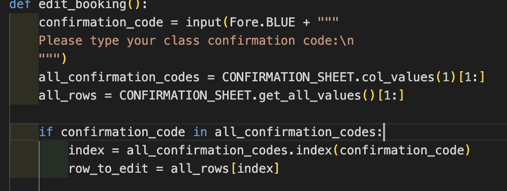

# FlexiBook - Analtics for Yoga Booking :lotus_position_woman::calendar:

### My Vision
This project is a simple web application built with Python. It enables users to book yoga classes and provides analytics on each class. The analytics are based on the number of bookings for each class, assisting the team in identifying which classes are more popular and which offers they can promote more effectively. This project is hosted on GitHub for version control and collaboration, and it can be deployed to Heroku, a cloud platform as a service (PaaS), for easy management and scalability.

[**Live Site**](https://flexibook-9e934dd29473.herokuapp.com/)

[**Repository link**](https://github.com/abikirkham/FlexiBook.git)

 

 
## Table of Contents

- [User Experience](#user_experience)
- [Design](#design)
- [Features](#features)
- [Technologies Used](#technologies_used)
- [Google Sheets](#google_sheets)
- [Testing](#testing)
- [Bug](#bugs)
- [Browser Capability](#browser_capability)
- [Deployment](#deployment)
- [Credits](#credits)

## User Experience

### For the Owner: :woman_technologist:
1. **Viewing Available Classes:** As the owner, I want users to easily view available classes, so they can make informed booking decisions.

2. **Integration with Google Sheets:** As the owner, I want to integrate Google Sheets for streamlined management of class schedules, confirmation of each booking and organisation.

3. **Analytics Tracking:** As the owner, I want to track user engagement and preferences through analytics, enabling me to tailor classes and improve overall user experience.

4. **Simplified Administrative Tasks:** As the owner, I want administrative tasks such as adding new classes or managing instructor schedules to be simplified and efficient, allowing me to focus more on providing quality services to users.

5. **Seamless Integration with Existing Systems:** As the owner, I want the booking system to seamlessly integrate with other existing systems or tools we use for business operations, reducing the need for manual data entry and ensuring consistency across platforms.

### For the User:
1. **Finding Available Classes:** As a user, I want to easily find available classes based on my preferred time slots and yoga styles, so I can plan my schedule effectively.

2. **Seamless Booking Experience:** As a user, I want to have a seamless booking experience, with clear instructions and intuitive interface, making it convenient to reserve my spot in desired classes.

3. **Detailed Class Information:** As a user, I want to see detailed information about each class, the date, time, and confirmation code, to help me make informed decisions.
  
4. **Easy Editing/Cancellation:** As a user, I want the ability to effortlessly edit or cancel my class bookings, ensuring flexibility in managing my schedule without encountering unnecessary obstacles.

5. **Distraction-Free Experience:** As a user, I want the booking platform to provide a distraction-free experience, with minimal ads or irrelevant content, allowing me to focus solely on finding and booking the classes that align with my needs and preferences.

## Design :art:

### Imagery 
The Flexibook logo, sourced from fsymbols.com, embodies adaptability and versatility through its design. The simplicity of the logo's typography belies its dynamic nature, mirroring the flexibility at the core of Flexibook's services. The use of text art adds a contemporary flair, emphasizing the brand's innovative approach. This logo promises a seamless and user-friendly experience, reflecting the convenience that Flexibook offers to its users.

  
Click to see my Logo.

 

### Colours
The color scheme drawn from Colorama, found on pypi.org, infuses Flexibook's branding with vibrancy and energy. Each color selected from Colorama contributes to the visual appeal and functionality of Flexibook's interface. The primary colors inject excitement and enthusiasm, encouraging user engagement, while the secondary colors provide balance and contrast for enhanced readability. Overall, the Colorama color scheme enhances Flexibook's branding, making it both visually appealing and user-friendly.

  
Click to see my Color Tool.

### Flow Chart
The flowchary was crafted when I was decisiding how I would structure and display my idea, this was created with [Miro](https://miro.com/app/board/uXjVNhD3dEI=/). This displays the option of the class booking sytem where the user will input their actions and generate a confirmation code once booked a class. The other options are for editting and cancelling the booked classes.

  
Click to see my flowchart.

  

### Requirements 
The deployment terminal is set to 80 columns by 24 rows. That means that each line of text needs to be 80 characters or less otherwise it will be wrapped onto a second line. This was indetified in the [Continuous Integration Python Linter](https://pep8ci.herokuapp.com/#) , which told you if you needed to shorten your lines when they were too long. 

## Features :framed_picture:

1. Run programme - Logo/Welcome message
 
 

2. Navigate the Menu:
Upon running the program, you will be presented with a menu where you can choose to book a class, edit your booking, or cancel your booking.
Functionality

4. Book a Class:
This option allows you to book a yoga class following guide below.
- Instructions:
  - When prompted, enter the day of the week you wish to book (e.g., Monday).

  - Then, choose a time slot from the available options.

  - Enter your name as requested.

  - Confirm the booking details when prompted. If correct, your booking will be confirmed with a unique confirmation code.

  - After completing an action, you will be prompted to press Enter to return to the main menu.

- Error Handling:
  - If you say no when confirming the details of booking.

  - If you input an invalid day or time, you will receive a notification to try again.

4. Edit Your Booking:
If you need to make changes to your existing booking, select this option.
- Instructions:
  - Enter your confirmation code when prompted.

  - Select the aspect of your booking you wish to edit (date or time).

  - Follow the prompts to make the necessary changes.

  - Confirm the changes to update your booking.

  - After completing an action, you will be prompted to press Enter to return to the main menu.

- Error Handling:
  - If you do not select the correct option, you will receive an error message.

  - If you input an invalid confirmation code or choose an incorrect option, you will be prompted to try again.

5. Cancel Your Booking:
Use this option if you need to cancel your existing booking.
- Instructions:
  - Enter your confirmation code when prompted.

  - Confirm the cancellation when prompted.

  - After completing an action, you will be prompted to press Enter to return to the main menu.

- Error Handling:
  - If you input an invalid confirmation code or choose an incorrect option, you will be prompted to try again.

## Technologies Used :desktop_computer:

- [HTML5](https://en.wikipedia.org/wiki/HTML5) [/CSS](https://en.wikipedia.org/wiki/CSS)
- [Python](https://en.wikipedia.org/wiki/Python_(programming_language))
- [Git](https://git-scm.com/) (Version Control)
- [GitHub](https://github.com/) (File Storage)
- [Heroku](https://www.heroku.com/) (Deployment)
- [GitPod](https://www.gitpod.io) (IDE)
- [Miro](https://miro.com/app/board/uXjVNhD3dEI=/) (Flowchart Creation)
- [LanguageTool](https://languagetool.org/) was used to check the grammar and spelling in the README and the Code.
- [ASCII Art Generator](https://patorjk.com/software/taag/#p=display&f=Small%20Keyboard&t=Type%20Something%20) (Logo Creation)
- [Google Spreadsheet](https://docs.google.com/spreadsheets/u/0/?pli=1) (Worksheet Creation)
- [Browserling](https://www.browserling.com/) (Cross-browser Testing)

### Libraries and Modules

- [`google.oauth2.service_account`](https://google-auth.readthedocs.io/en/master/reference/google.oauth2.service_account.html) (Google Authentication)
- [`gspread`](https://docs.gspread.org/en/v5.10.0/) (Google Sheets Functionality)
- [`colorama`](https://pypi.org/project/colorama/) (Text Coloring in Terminal)
- [`simple_menu`](https://pypi.org/project/simple-term-menu/) (Menu Functionality)

## Google Sheets
In the Flexibook application's Google Sheets section, the integration between Python code and Google Sheets facilitates seamless monitoring of yoga class bookings. The Google Sheets section serves as a centralised hub for tracking class reservations, displaying essential details such as confirmation code, day, time, and participant's name. This integration allows for efficient management of bookings, with options to book, edit, or cancel classes directly from the sheet. When booking a class, users input their details via the Python code, which updates the corresponding sheet fields. The edit functionality recognises confirmation codes to modify class dates or times, ensuring accurate scheduling. Additionally, the cancel option identifies confirmation codes and removes corresponding bookings upon confirmation, providing flexibility and ease of use for both users and yoga instructors. Below are the pieces of code I used to implement this:

- I used Code Institutes Project 3 Love-Sandwhiches tutorial to help me initaially understand how to import my google sheets, below there is a path on how I did this, but here you will find an image of my code.

  
- The input of booking

   
- Recognisation of confirmation code

   
- The change

   
- The cancel

   
- The charts - I added these charts on my google sheet which will constantly chnage as the application is used. This is for the owner of the sheet to monitor the most and least popular dates and times.
 

## Testing :abacus:
 ### Validation Testing
   - [Continuous Integration Python Linter](https://pep8ci.herokuapp.com/#)
     - Upon running the Python Linter for `run.py`, initial findings revealed warnings regarding trailing whitespace and errors due to line length exceeding standards. After rectifying these issues, subsequent runs reported no errors. See image below for details.

    
   - [HTML Validator](https://validator.w3.org/)
     - Evaluation of `layout.html` was conducted using the W3C HTML Validator. Notably, after incorporating a favicon, meta description and a  title within `layout.html`, the Nu HTML Checker was employed for verification. Refer to the image for more information.

   
### Manual Testing 

| Test | Test Description | Expected Outcome | Result |
|------|------------------|------------------|--------|
| Input of day - Monday | .... | To go to next selection of time. | result |
| Input of day - Tuesday | ..... | To go to next selection of time. | result |
| Input of day - Wednesday | ..... | To go to next selection of time. | result |
| Input of day - Thursday | ..... | To go to next selection of time. | result |
| Input of day - Friday | ..... | To go to next selection of time. | result |
| Input of day - Saturday | ..... | To go to next selection of time. | result |
| Input of day - Sunday | ..... | To go to next selection of time. | result |
| Input of day - Error | ..... | Will ask to input again. | result |
| Input of time - 8:30AM | ..... | To go to next selection of Name. | result |
| Input of time - 12:00PM | ..... | To go to next selection of Name. | result |
| Input of time - 13:30PM | ..... | To go to next selection of Name. | result |
| Input of time - 15:00PM | ..... | To go to next selection of Name. | result | 
| Input of time - 17:45PM | ..... | To go to next selection of Name. | result |
| Input of time - Error | ..... | Will ask to input again. | result |
| Input of name - yes | ..... | To go to next selection of confirmation. | result |
| Input of name - no | ..... | To go to next selection of confirmation. | result |
| Input of confirmation code | ..... | To go to next selection action. | result |
| Input of confirmation code - Error | ..... | Will ask to input again. | result |
| Input of choice - 1/2 | ..... | To go to selected option. | result |
| Input of enter - return to menu | ..... | To go to main menu. | result |

## Bugs :ant:

Clearing the screen:
First I had implemented the following function to clear the screen:

    def clear_screen ():
        '''
        Clears the screen from text
        '''
        os.system('cls' if os.name == 'nt' else 'clear')
Unfortunately, this version did not delete the entire screen in the deployed version of the application(it did work properly in my IDE), but only the visible area. Parts of the logo were displayed twice when the screen emptied, as soon as the text was longer than the viewport. My mentor Brian Macheria then gave me a version with which the function worked smoothly:

    print("\033c", end="")
Initially, I had this version as a backup, but after another conversation with my mentor, I deleted the original version.

Typing-print statement in the weight/height validation: 
When validating the input of size and weight, the typing-print statement: "Your height/weight should be given in m/kg and contain a point for the decimal place." always appeared again if the user has given a value outside the reasonable range, but it should only appear once at the beginning. I could fix this by changing the position of this typing-print statement.

Duplicate the worksheet user 
After I made the project available for code review in the Slack community of the Code Institute, I was told that the age calculation for the "Happy Birthday" message of a 104-year-old was apparently incorrect. After checking the corresponding function that worked as expected, I looked into the spreadsheet and found that someone clearly did not exit the application correctly. The still existing worksheet with the old data in it was then copied and not the user worksheet. Since the functions of the trivia theme rely on a special cell(F2), only the value of this copied sheet (in this case with an age of 45) was used. I was able to fix this by referring to the worksheet’s name:

    WORKSHEET_USER = SHEET.worksheet('User')
instead of the worksheet’s index:

   WORKSHEET_USER = SHEET.get_worksheet(0)

## Browser Capability :computer:

The tests were conducted using the following browsers:
Google Chrome Version 121.0.6167.160 
The following tests were conducted by using browserling 
Edge Version 118
Firefox 119
Opera 104
I have tested the website on Safari on macOS Sonoma 14.3, but unfortunately, it just opens the website and starts the program, but I can’t enter any input.

## Deployment :printer:

The tests were conducted using the following browsers:
Google Chrome Version 121.0.6167.160 
The following tests were conducted by using browserling 
Edge Version 118
Firefox 119
Opera 104
I have tested the website on Safari on macOS Sonoma 14.3, but unfortunately, it just opens the website and starts the program, but I can’t enter any input.

#### Github/Heroku

**Pushing Changes:**
- `git add`: This command was used to add the file(s) to the staging area before they are committed.
- `git commit -m "commit message"`: This command was used to commit changes to the local repository queue ready for the final step.
- `git push`: This command was used to push all committed code to the remote repository on GitHub.

#### Deploying a GitHub Repository via GitHub Pages

1. In your Repository section, select the Repository you wish to deploy.
2. In the top horizontal Menu, locate and click the Settings link.
3. Inside the Setting page, around halfway down locate the GitHub Pages Section.
4. Under Source, select the None tab and change it to Main and click Save.
5. Finally, once the page resets, scroll back down to the GitHub Pages Section to see the following message: "Your site is ready to be published at (Link to the GitHub Page Web Address)". It can take time for the link to open your project initially, so please don't be worried if it does not load immediately.

#### Making a Local Clone

1. Find the GitHub Repository.
2. Click the Code button.
3. Copy the link shown.
4. In Gitpod, change the directory to the location you would like the cloned directory to be located.
5. Type `git clone`, and paste the link you copied in step 3.
6. Press Enter to have the local clone created.

## Creating a Google Spreadsheet and Integrating it using API

### Creating the Google Spreadsheet:

1. **Log in** (or sign up) to your Google Account.
2. **Access Google Spreadsheet:** Navigate to Google Sheets.
3. **Create a new spreadsheet** and give it a descriptive name, e.g., 'life-in-numbers' like the name of the application.
4. **Rename the worksheet** (e.g., 'user') and add, if necessary, additional worksheets.
5. **Add headings** (Name, Birth year, Gender (m/f), Height in m, Weight in kg, Age).

### Setting up the APIs:

1. **Navigate to the Google Cloud Platform:**
   - Create a new project by clicking the button "Select a project" and then selecting "New project."
   - Give the project a descriptive and meaningful name, e.g., life-in-numbers, and click on the "CREATE" button.
   - In the Notifications pop-up, click on "SELECT PROJECT."
   
2. **On the project page:**
   - Go to the menu (click the burger icon in the top-left corner of the page), click on "APIs and services," and then select "Library."
   - In the search bar, search for "Google Drive" and enable it.
   - Click on "Credentials" in the sidebar and then select "+ CREATE CREDENTIALS > Help me choose."
   
3. **Credential setup:**
   - Select "Google Drive API" and "Application Data" in the Credential Type section and click on the "NEXT" button.
   - Enter a custom service name and click the "CREATE AND CONTINUE" button.
   - Select "Editor" as the role in the Quick access section Basic and press the "CONTINUE" button.
   - Leave the form fields in the next question blank and click on "DONE."
   - Click on the email from the newly created Service Account.
   - Click on the Tab "KEYS" and then select "Create new key" from the dropdown menu of the "ADD KEY" button.
   - Keep the key type as JSON and click the "CREATE" button. Download the JSON file to your local machine.

4. **Enable Google Sheets API:**
   - Go back to the library again, search for "Google Sheets API," and enable it.

5. **Drag and drop credential-json file:**
   - Drag and drop the credential JSON file (downloaded after step 3) into the workspace and rename it as "creds.json" for simplicity.

6. **Sharing the Spreadsheet:**
   - Open the JSON file in the workspace, copy the client email (without the quotes).
   - Go to the created Google Spreadsheet, click the "Share" button.
   - Paste in the email address (from step 6), select "Editor," and then click "Share."

### Connecting the APIs to Python:

1. **Install dependencies:**
   - In the workspace terminal, run the command 'pip3 install gspread google-auth'.
   
2. **Import libraries:**
   - Import the gspread library at the top of the Python file in the workspace.
   - Import the Credentials from the Google Auth Account (google.oauth2.service_account).
   
3. **Set SCOPE and create CREDS:**
   - Set the SCOPE, listing the APIs the program needs to access to run.
   - Create CREDS using the gspread authorize method to access the created worksheet data.

**Note:** Ensure the JSON file is never committed to GitHub as it contains sensitive information. Create a .gitignore file in the workspace and add the name of the JSON file to it.

## Credits :pray:

### Content 
- The idea originated from my first project with Code Institute, fueled by my passion for yoga and aspirations for future progression—a booking system for yoga classes.

### Code

- Leveraged the walkthrough project "Love Sandwich" from Code Institute to utilize the gspread library, set APIs, update worksheets, and fetch data.
- ASCII text art logo sourced from [fsymbols.com](https://fsymbols.com/text-art/)
- Menu implementation guidance provided by tutor, sourced from [simple-term-menu](https://pypi.org/project/simple-term-menu/)
- Utilized a random code generator from [Stack Overflow](https://stackoverflow.com/questions/2257441/random-string-generation-with-upper-case-letters-and-digits)
- Referenced various online resources including:
  - Google
  - W3C
  - W3schools
  - Stack Overflow
  - Slack Community

### Media

- To install [Colorama](https://pypi.org/project/colorama/) , I found this website very useful for the easiest ways to install.
- For style examples to go with my Colorama installation, I found this blog by [Amy Richardson](https://www.codu.co/articles/adding-colour-to-python-code-lbai_0u7).
- For the icon on the page to make more personalised, I used the installation of [Favicon](https://favicon.io)

### ReadMe 

- Continuously refining the ReadMe based on feedback from fellow students on Slack, with input from mentors such as Gareth Moore and Julia Kinivalova.
- For the mock-up design, I used this [generator](https://techsini.com/multi-mockup/)
- Emojis for the sub-headings to break the sections up in a more defined way, I used [GitHub Tools](https://github.com/ikatyang/emoji-cheat-sheet/blob/master/README.md)

For educational purposes only.
